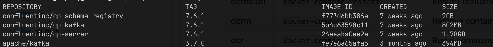

# Docker image size comparison 


 Setup local kafka
### Confluent default docker-compose

Docker-compose cloned from [cp-all-in-one](https://github.com/confluentinc/cp-all-in-one/tree/7.5.0-post/cp-all-in-one-kraft)

Example in docker-compose.classic.yml file in root dir.

### Apache Kafka and Karapache
1. [Kafka from Apache](https://github.com/apache/kafka/blob/trunk/docker/examples/README.md)

2. [Karapace](https://github.com/Aiven-Open/karapace/blob/main/container/compose.yml)
https://github.com/aiven-open/karapace/pkgs/container/karapace

### Multi-node setup
Aby możliwe było zwiększenie `--replication-factor 3`
- https://docs.confluent.io/platform/current/kafka/multi-node.html
- https://github.com/confluentinc/kafka/blob/b563b6900a480b70675a24001f639d84b3167989/docker/examples/README.md

```shell
kafka-topics --list --bootstrap-server localhost:9092

kafka-topics --create --bootstrap-server localhost:9092 \
--partitions 3 --replication-factor 3 \
--topic polish_pageviews

kafka-topics --bootstrap-server localhost:9092 --describe --topic polish_pageviews
```
### Test local setup when using Confluent stack
```sh
kafka-topics --list --bootstrap-server localhost:9092
```
output
```sh
__consumer_offsets
_confluent-command
_confluent-link-metadata
_confluent-metrics
_confluent-telemetry-metrics
_confluent_balancer_api_state
_schemas
```
