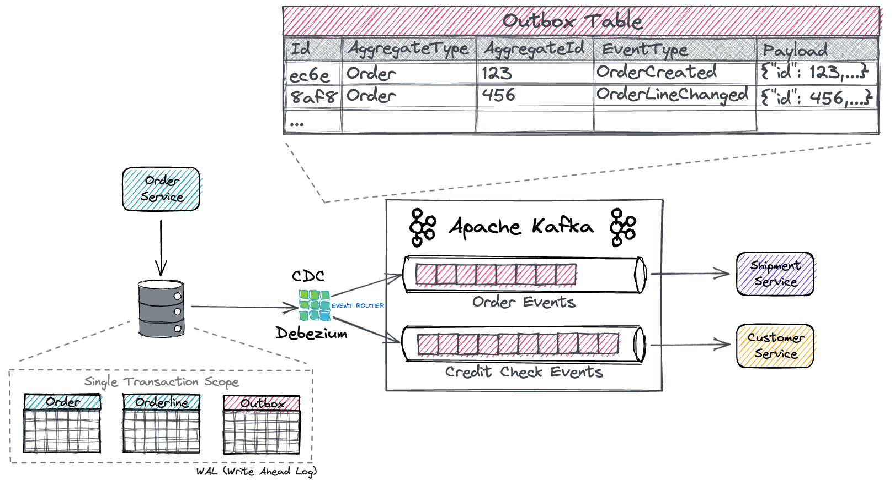

## Zapisy atomowe z wieloma partycjami
Transakcje umożliwiają zapis atomowy w wielu topikach i partycjach platformy Kafka. Wszystkie wiadomości zawarte w transakcji zostaną pomyślnie zapisane lub żadna z nich nie zostanie zapisana. Przykładowo błąd podczas przetwarzania może spowodować przerwanie transakcji, w takim przypadku żaden komunikat z transakcji nie będzie czytelny dla konsumentów. Przyjrzymy się teraz, w jaki sposób umożliwia to atomowe cykle odczytu, procesu i zapisu.

Najpierw zastanówmy się, co oznacza atomowy cykl odczytu, procesu i zapisu. W skrócie oznacza to, że jeśli aplikacja zużywa komunikat A na przesunięciu X jakiejś partycji topicu tp0 i zapisuje komunikat B do partycji topicu tp1 po przetworzeniu komunikatu A w taki sposób, że B = F(A), to cykl odczytu-procesu-zapisu jest niepodzielny tylko wtedy, gdy wiadomości A i B zostaną pomyślnie wykorzystane i opublikowane razem lub wcale.

Teraz wiadomość A zostanie uznana za wykorzystaną z partycji topicu tp0 tylko wtedy, gdy jej offset X zostanie oznaczone jako wykorzystane. Oznaczenie offset jako zużytego nazywa się offset commit. W Kafce rejestrujemy commit offset, pisząc do wewnętrznego topicu Kafki zwanego __consumer_offsets. Wiadomość uważa się za wykorzystaną tylko wtedy, gdy jej offset jest zatwierdzone w topicu offsetów.

Zatem ponieważ commit offset jest po prostu kolejnym zapisem do topicu Kafki i ponieważ wiadomość jest uważana za zużytą tylko wtedy, gdy zacommitowano jej offset, zapisy atomowe w wielu topicach i partycjach umożliwiają również atomowe cykle odczyt-proces-zapis: zatwierdzenie offsetu X do topic offsetów i zapis komunikatu B do tp1 będzie częścią pojedynczej transakcji, a zatem niepodzielną.

offset = przesunięcie

## Outbox pattern
### Problem
Jak atomowo zaktualizować bazę danych i wysłać wiadomości do brokera wiadomości?

### Opis
gdy usługa obsługuje polecenie i musi zmienić stan w bazie danych i opublikować wiadomość/zdarzenie w Kafce, należy wykonać jedno lub drugie. Tj. jeśli transakcja w bazie danych nie powiedzie się, wiadomość do Kafki nie może zostać opublikowana. Aby rozwiązać ten problem, komunikat(y), które mają zostać opublikowane w Kafce, są przechowywane w bazie danych w tej samej transakcji i ostatecznie publikowane w Kafce (po pomyślnym zatwierdzeniu transakcji)

Najpierw zatwierdzenie wiadomości w trwałym magazynie danych (tabela Skrzynki nadawczej), a następnie osobna usługa odpytuje tabelę Skrzynki nadawczej i publikuje wiadomość w temacie Apache Kafka.

Przykład

- Saga Pattern (Saga Orchestration): Distributed transaction span multiple services.
- Outbox Pattern: Avoid dual-writes, no 2PC required using Kafka,Kafka Connect, Debezium , Outbox Event Router

### Uwagi
Ten pattern ma również następujące problemy:

Producer wiadomości może opublikować wiadomość więcej niż raz. Może na przykład ulec awarii po opublikowaniu wiadomości, ale przed zarejestrowaniem faktu, że to zrobił.
Po ponownym uruchomieniu opublikuje wiadomość ponownie. W rezultacie odbiorca wiadomości musi być idempotentny, być może poprzez śledzenie identyfikatorów wiadomości, które już przetworzył.
Na szczęście, ponieważ konsumenci wiadomości zwykle muszą być idempotentni (ponieważ broker wiadomości może dostarczać wiadomości więcej niż raz), zazwyczaj nie stanowi to problemu.
