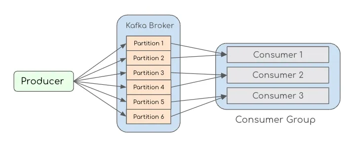

## setup + ćwiczenie 1 produce

1. Po sklonowaniu repozytorium, przejdź do terminala, zainstaluj zależności
   ```sh
   npm i
   ```
2. Otwórz IDE, zaimportuj projekt
3. Przejrzyj w IDE plik `.env.local`, zweryfikuj czy porty brokera i schema-registry są takie jak w pliku docker-compose.
4. W osobnym terminalu, uruchom kafkę poprzed docker-compose. [Dlaczego taki setup?](../../docs/local.md)
   ```sh
   docker-compose -f dc.apache.yml up
   ```
   za pierwszym razem, proces może trwać dłużej niż zwykle gdyż w zależności od prędkości połączenia internetowego będą ściągane obrazy docker.
5. Otwórz terminal kafka w docker desktop
   
       docker desktop > open dashboard > containers > [kafka-nodejs-playground] > [broker] > Exec (*tab)
       
       cd /opt/kafka/bin
   LUB Zainstaluj klienta kafka lokalnie.
   ```sh
   brew install kafka
   ```
   
6. wylistuj wszystkie topiki
   ```sh
   #local: 
      kafka-topics --list --bootstrap-server localhost:9092
   #via docker exec tab: 
      ./kafka-topics.sh --list --bootstrap-server localhost:9092
   ```
7. Stwórz topic
   ```sh
   kafka-topics --create --bootstrap-server localhost:9092 \
    --partitions 1 --replication-factor 1 \
    --topic step1.first.topic
   #delete topic
   kafka-topics --delete --topic step1.first.topic --bootstrap-server localhost:9092
   ```
   - [CLI 1. Kafka Console Producer + Kafka Console Consumer](https://rustic-candytuft-314.notion.site/Publish-Subscribe-b17cfbb86a2d46f887db1b54d887afa2)
8. Stwórz topic via skrypt `adm_create_topic.ts` wklej poniższy kod w odpowiednie miejsce `//FIXME`
   ```typescript
   const topics = await admin.createTopics({topics: [{topic: 'step1.from.script'}]})
   ```
9. uruchom `producer.ts`
    ```sh
   npm start src/step1/producer.ts
   ```
10. wylistuj topiki tym razem poprzez skrypt 
    ```sh
    npm start src/step1/adm_list_topics.ts
    ``` 
5. Gdy zauważysz błąd: `"error":"This server does not host this topic-partition"` spróbuj stworzyć odpowiednio nazwany topik
7. Topik można stworzyć na 2 sposoby manualnie albo automatycznie: 
   - automatycznie, ustawiając w producerze `auto.create.topics` na true  
   - manualnie skryptem `adm_create_topic`  
   - manualnie via CLI
8. powtórz uruchomieine `producer.ts`
9. Uruchom polecenie `describe topic` aby odczytać metadane dot. topic
   ```shell
   kafka-topics --bootstrap-server localhost:9092 --describe --topic polish.hellos
   ```
  - ile partycji, replic, ISR (in-sync-replicas)
10. Stwórz topic z 3 partycjami i replication-factor = 1.

