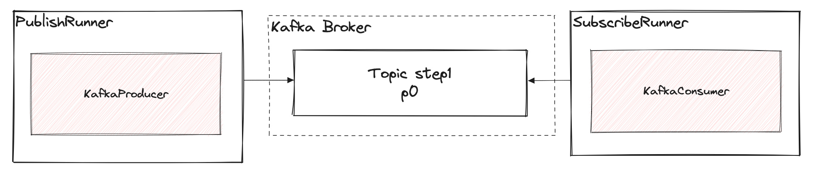

# 2 consume
**DOBRA PRAKTYKA**: consumer.connect wywołane raz na początku procesu

1. Jeśli podczas nauki odczytasz wszystkie wiadomości w topika i tym "przesuniesz offset" to po prostu dodaj kolejna testową wiadomość via
   ```shell
   npm start src/step1_produce_create_topic/producer.ts
   ```
2. W pliku `consumer.ts` ustaw nazwę topica na 'polish.hellos' 
3. Uruchom `consumer.ts`
4. Zaobserwuj brak komunikatu i zakończenie wykonywania skryptu bez zwrotu komunikatu.
5. wybierz rozwiązanie:
  - blokowanie na sygnał z konsoli, wklej poniższy kod przed ostatnią linią
    ```typescript
     async function gracefullyClose() {
     await consumer.disconnect()
     }
     process.on('SIGINT', gracefullyClose)
     process.on('SIGTERM', gracefullyClose)
     ```
  - LUB serwer express, wklej poniższy kod na końcu pliku
    ```typescript
     const app = express()
     app.use(express.json());
     app.use(express.urlencoded({
     extended: false,
     }));
     
     const server = app.listen(9123, () => {
     console.log(`Server is listening on ${9123}`);
     });
     
     ```
    QUIZ: Czy wywołanie `consumer.disconnect` jest konieczne na koniec przetwarzania? Co się zadzieje implicite? 
6. Zasyskrubj się na event HEARTBEAT, znajdź  interwał w jakim broker pinguje konsumenta. Wklej poniższy kod
   ```typescript
   consumer.on('consumer.heartbeat', (ev)=> console.log(new Date(), ev))
   ```
7. uruchom `consumer.ts` jeszcze raz, zaobserwuj procesowanie
8. uruchom producer ze step1 `npm start src/step1_produce_create_topic/producer.ts` jeśli chcesz zobaczyć kolejne wiadomości
9. wylistuj grupy konsumentów
   ```sh
   kafka-consumer-groups --bootstrap-server localhost:9092 --list
   ```
10. sprawdź LAG konsumenta dla wybranego topika
   ```sh
   kafka-consumer-groups --bootstrap-server localhost:9092 --group my-test-consumer --describe
   ```
11. zresetuj TESTOWO offset (UWAGA operaja wrażliwa lepiej świadomie nie uruchamiać na PRODUKCJI )
   ```sh
   kafka-consumer-groups --bootstrap-server localhost:9092 \
   --topic polish.hellos --group my-test-consumer \
   --reset-offsets --to-earliest --execute
   ```
   sprawdź CURRENT-OFFSET oraz LAG ponownie
12. zapoznaj się z definicją ustawienia 'from-beggining' https://kafka.js.org/docs/consuming#a-name-from-beginning-a-frombeginning
13. BONUS narzędzie [kcat](./cli_kcat.md)

PODSUMOWANIE:
- ile razy wołać consumer.connect?
- co to jest LAG?
- co ile sekund generowany jest heartbeat?
