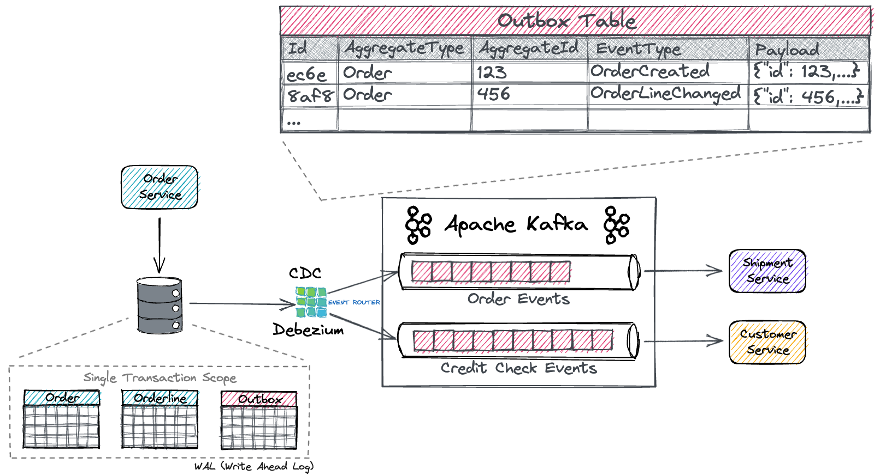

## Outbox pattern
### Problem
Jak atomowo zaktualizować bazę danych i wysłać wiadomości do brokera wiadomości?

### Opis
gdy usługa obsługuje polecenie i musi zmienić stan w bazie danych i opublikować wiadomość/zdarzenie w Kafce, należy wykonać jedno lub drugie. Tj. jeśli transakcja w bazie danych nie powiedzie się, wiadomość do Kafki nie może zostać opublikowana. Aby rozwiązać ten problem, komunikat(y), które mają zostać opublikowane w Kafce, są przechowywane w bazie danych w tej samej transakcji i ostatecznie publikowane w Kafce (po pomyślnym zatwierdzeniu transakcji)

Najpierw zatwierdzenie wiadomości w trwałym magazynie danych (tabela Skrzynki nadawczej), a następnie osobna usługa odpytuje tabelę Skrzynki nadawczej i publikuje wiadomość w temacie Apache Kafka.

Przykład

- Saga Pattern (Saga Orchestration): Distributed transaction span multiple services.
- Outbox Pattern: Avoid dual-writes, no 2PC required using Kafka,Kafka Connect, Debezium , Outbox Event Router

### Uwagi
Ten pattern ma również następujące problemy:

Producer wiadomości może opublikować wiadomość więcej niż raz. Może na przykład ulec awarii po opublikowaniu wiadomości, ale przed zarejestrowaniem faktu, że to zrobił.
Po ponownym uruchomieniu opublikuje wiadomość ponownie. W rezultacie odbiorca wiadomości musi być idempotentny, być może poprzez śledzenie identyfikatorów wiadomości, które już przetworzył.
Na szczęście, ponieważ konsumenci wiadomości zwykle muszą być idempotentni (ponieważ broker wiadomości może dostarczać wiadomości więcej niż raz), zazwyczaj nie stanowi to problemu.
